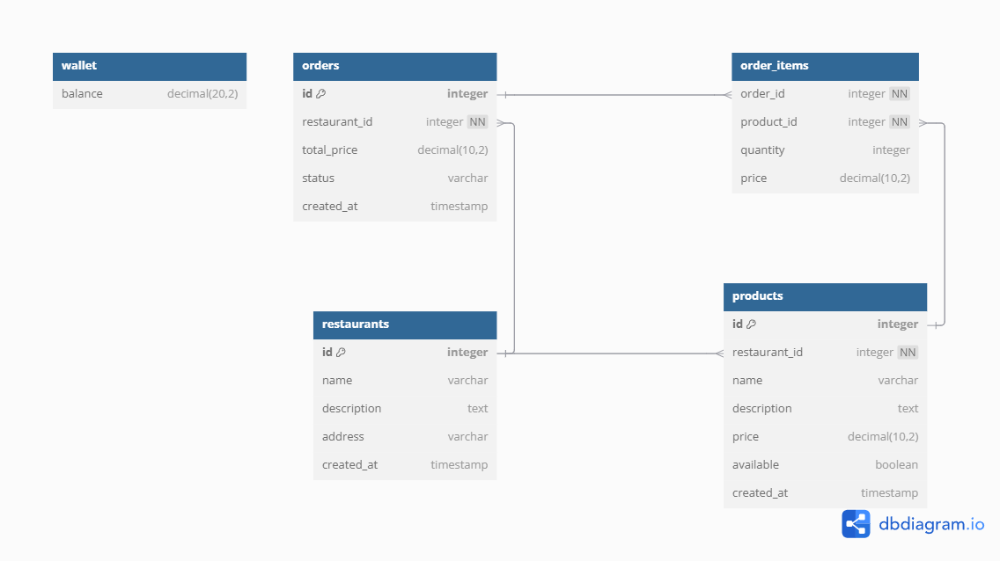

# APS iFood

## Introdução
O projeto tem como objetivo desenvolver um aplicativo de gerenciamento de pedidos, focado no CRUD de pedidos, onde os usuários poderão visualizar restaurantes, selecionar pratos, definir quantidades e simular pagamentos utilizando um saldo fixo em carteira. O desenvolvimento do sistema será baseado na aplicação de padrões de projeto definidos pelo GoF (Gang of Four), garantindo modularidade, reutilização de código e uma estrutura organizada para facilitar a manutenção e evolução do software.

## Requisitos
- [ ] CRUD de restaurantes
- [ ] CRUD de produtos por restaurante
- [ ] Compra de produtos
    - Listagem de restaurantes;
    - Filtro de cardápio do restaurante;
    - 1 (um) restaurante por carrinho;
    - Carteira e saldo.

## Diagrama ERM


## 🚀 Como Executar o Projeto

O projeto está dividido em duas pastas principais:

📁 `ifood/` → **Frontend** (Ionic + Angular)  
📁 `server/ifood/` → **Backend** (Spring Boot + Docker)

### 🛠️ Pré-requisitos

Certifique-se de ter instalado:

- [Node.js](https://nodejs.org/) (v16+)
- [Ionic CLI](https://ionicframework.com/docs/cli)  
  ```bash
  npm install -g @ionic/cli

## 🔧 Como Executar o Projeto

### 🔙 Backend - Spring Boot + Docker  
**📁 Caminho:** `server/ifood/`

#### Passos para execução:

1. Acesse a pasta do backend:

   ```bash
   cd server/ifood
Suba os containers (como o banco de dados):

docker compose up -d

📲 Frontend - Ionic + Angular
📁 Caminho: ifood/

Passos para execução:
Acesse a pasta do frontend:


    cd ifood
Instale as dependências:


    npm install

Inicie o servidor de desenvolvimento:

    ionic serve
    
